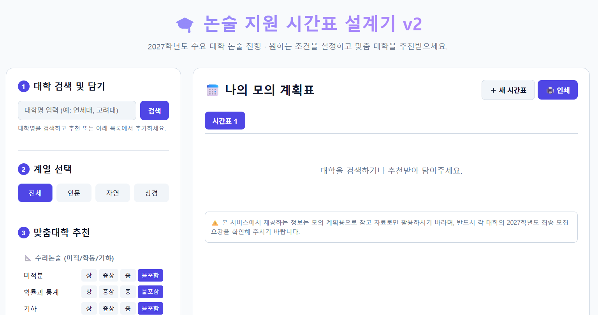
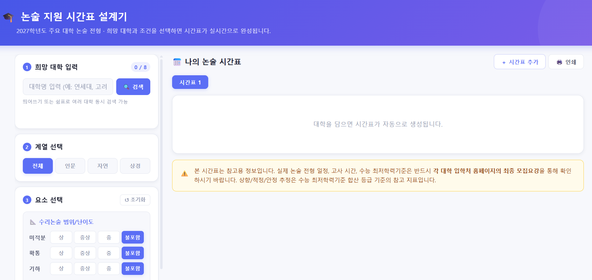
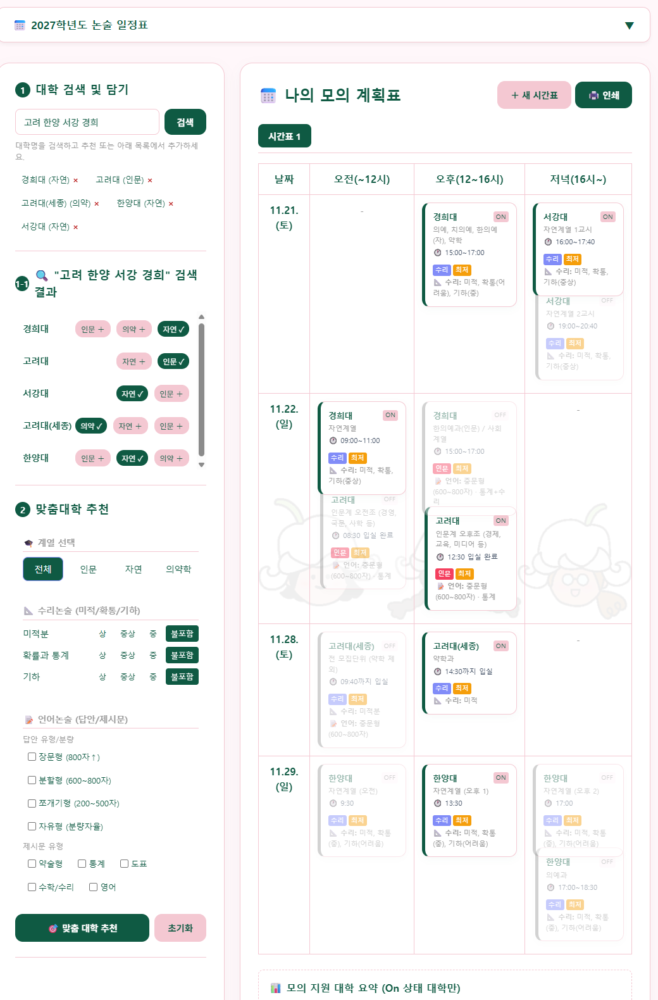
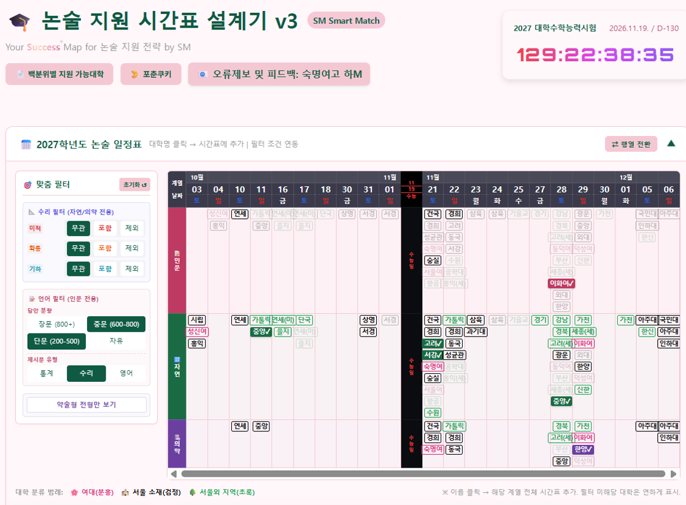
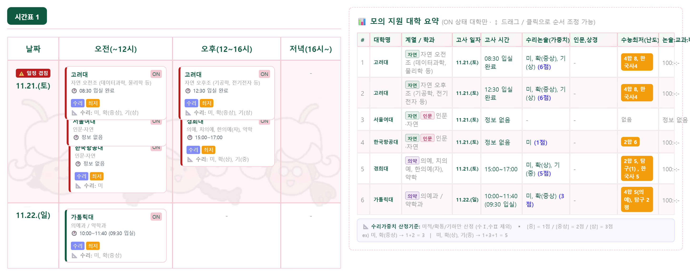
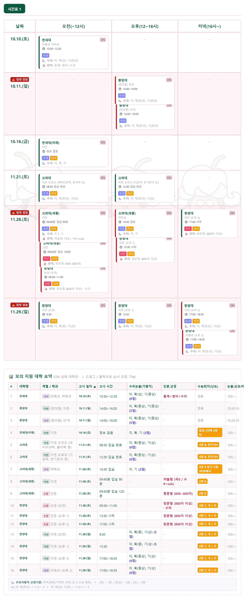

**"Your Success Map for 논술 지원 전략 by SM"**

# 🎓 Non술 지원 시간표 설계기 (SM Smart Match)
**"수시 6논술, 어떻게 써야 할지 막막하다면? 내 손으로 직접 짜는 논술 합격 로드맵!"**

---

### 📸 인터페이스 버전별 변천사 (History)
v1-1의 최초 기획 가안부터 고도화된 v3 최신 버전까지의 시각적 발전 과정입니다. (이미지 클릭 시 크게 보기 가능)

| 초기 기획 및 디자인 (v1) | Transpose 시각화 (v2) | 맞춤 필터 고도화 (v3) | 가로/세로 캡처 최적화 (v4) |
| :---: | :---: | :---: | :---: |
|  ▼  |  |  |  ▼  |

---

### 🌟 이럴 때 쓰면 완전 좋아요! (주요 기능)

1. **"내가 가고 싶은 대학, 일정 안 겹칠까?" (대학 검색 및 시간표)**
   - 평소 마음에 품고 있던 대학(ex. 연세대, 성균관대)을 검색해서 담기만 하세요. 우측 시간표에 시험 일정이 달력 형태로 쫙 펼쳐집니다. 날짜나 시간이 겹치는지 한눈에 팩트 체크 가능!
2. **"내 실력에 딱 맞는 논술은 어디지?" (맞춤 대학 추천)**
   - 수리논술에서 '미적분'이나 '기하'가 쥐약인가요? 혹은 '장문형' 글쓰기에 자신 있나요?
   - 내 강점과 약점(출제 범위, 난이도, 제시문 유형 등)을 체크하고 **`🎯 맞춤 대학 추천`**을 누르면, 나에게 찰떡같이 유리한 대학 리스트를 싹 뽑아줍니다.
3. **"이렇게 써볼까? 저렇게 써볼까?" (새 시간표 탭 & 가로/세로 이미지 캡처)**
   - 수시 6장, 경우의 수가 많죠? `＋ 새 시간표` 버튼을 눌러 상향 지원용(Plan A), 적정 지원용(Plan B) 등 여러 버전의 시간표를 탭으로 만들어 비교해 볼 수 있어요.
   - 완성된 계획표는 가로형 카메라 버튼(`📷 가로 ▬ 캡처`)으로 좌우 나란히 배치해 한눈에 들어오는 가로 이미지(`v4캡처_가로.png`)로 캡처하거나, 세로형 카메라 버튼(`📸 세로 █+█ 캡처`)으로 시간표 아래에 요약표를 나열한 길쭉한 형태의 고해상도 세로 이미지(`v4캡처_세로.png`)로 다운로드할 수 있습니다.

---

### 📝 따라만 하면 끝! (초간단 사용 방법)

**STEP 1. 타겟 대학 검색하기**
- 왼쪽 위 **[1. 대학 검색 및 담기]** 창에 목표 대학을 검색해서 찜(추가)해 주세요.

**STEP 2. 나만의 필터링 걸기 (핵심!)**
- **[2. 계열 선택]**에서 인문/자연을 고르고, **[3. 맞춤대학 추천]**에서 내가 피하고 싶은 과목이나 자신 있는 문제 유형을 체크해 보세요. 
- 짠! 하고 나타난 추천 대학 중 마음에 드는 곳을 추가로 담아줍니다.

**STEP 3. 이리저리 시간표 굴려보기**
- 오른쪽 **[📅 나의 모의 계획표]**를 보세요. 대학들이 달력에 들어가 있죠?
- 겹치는 일정이 있다면 버튼을 껐다 켰다(On/Off) 하면서 최고의 동선을 만들어 보세요.
- 하단의 **[📊 모의 지원 대학 요약]**에서 내가 최종 픽(Pick)한 6개 대학을 한눈에 확인할 수 있습니다. (행 드래그나 클릭을 통해 원하는 순서대로 자유롭게 이동이 가능합니다.)

---

### 🍯 알면 무조건 이득인 수험생 꿀팁!

- **💡 꿀 1: '백분위별 지원 가능대학' **
  - 내 모의고사 성적(백분위)으로 어느 대학 논술을 쓰는 게 적절한지 은밀한(?) 가이드라인을 얻을 수 있습니다. 상향/적정/하향 라인 잡아보기 !
- **💡 꿀 2:  '🥠포춘쿠키' 까기**
  - 스트레스받을 때 까자 까!, 따뜻함이 기다리고 있습니다.
- **💡 꿀 3: 교사들의 피 땀 눈물(?) 일정표 컨닝하기**
  - `📅 2027학년도 논술 일정표` 서울시교육청에서 인정받은 한 장짜리 전체 요약본을 볼 수 있어요. 큰 그림 그릴 때 유용합니다.

> ⚠️ **마지막 주의사항:** 여기서 짠 시간표는 '가안'일 뿐이에요! 원서 접수 버튼을 누르기 직전에는 반드시 관심 대학 입학처 홈페이지에 들어가서 **2027학년도 최종 모집 요강(특히 시험 시간!)**을 더블 체크하는 것, 절대 잊지 마세요!
