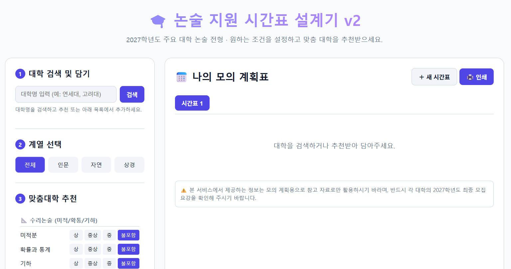
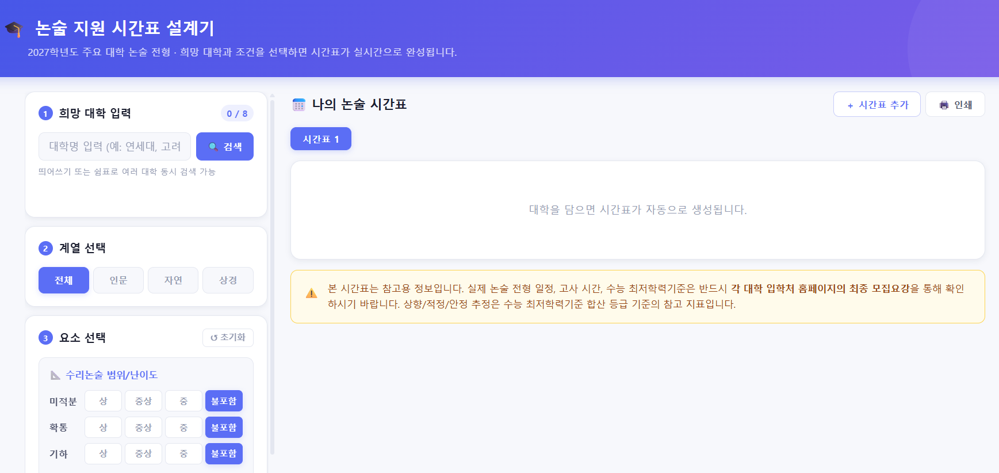
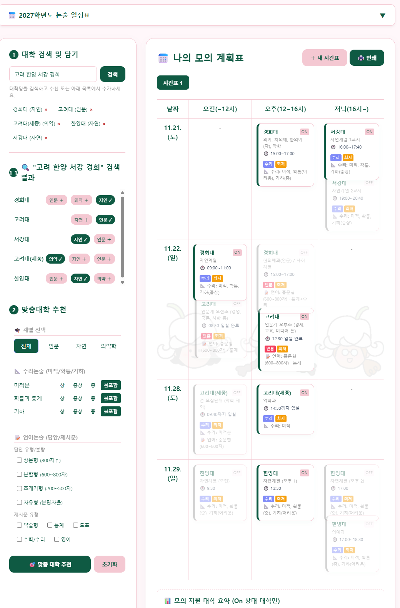
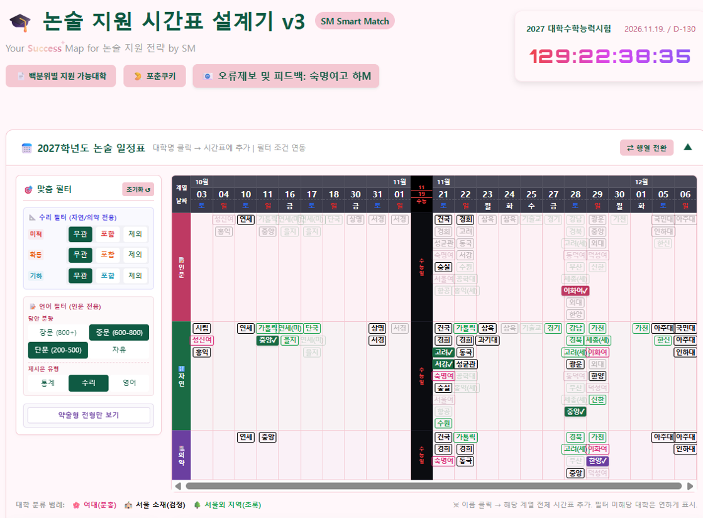
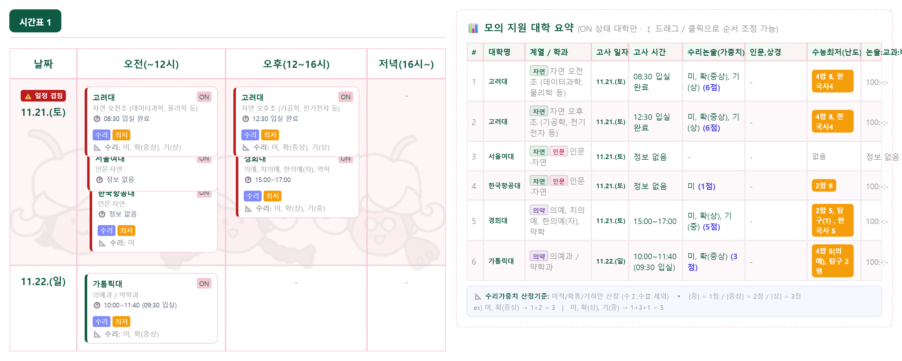
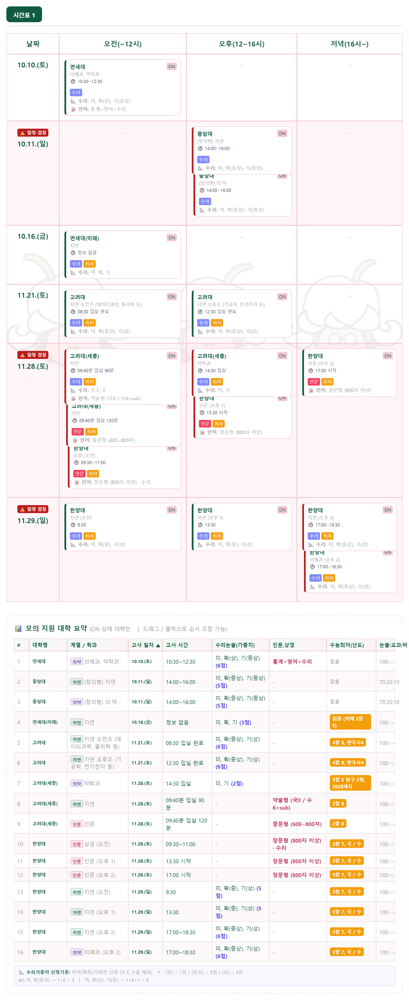

 

# 🎓 논술 지원 시간표 설계기 v6
### *SM Smart Match — Your **Success Map** for 논술 지원 전략*

> **수시 6논술, 어떻게 써야 할지 막막하다면?**  
> 전국 주요 대학 논술 일정과 전형 정보를 한 곳에 모아,  
> **나만의 합격 로드맵**을 단계별로 직접 설계하세요.

 

[]
[]
[]

---

## 📸 Version History

| 초기 기획 (v1) | Transpose 시각화 (v2) | 맞춤 필터 고도화 (v3) | 가로/세로 최적화 (v4) |
| :---: | :---: | :---: | :---: |
|  ▼  |  |  |  ▼  |

| 버전 | 주요 업데이트 |
|---|---|
| **v6** | **🔍 조건별 대학 탐색 & 정렬 팝업** 탑재 (자연/인문/의약 계열 선택 $\rightarrow$ 수능최저순/수학가중치순 정렬 & 내 시간표 등록/후보 비교) · **🎯 통합 슬림 퀵 도크(Dock)** 적용 (맨위/설명서/조건정렬/합격점수/맨아래) · **✏️ 캡처 메모 드로잉 도구** (펜·형광펜·획지우개) |
| **v5** | **📊 논술 합격 점수 분석 대시보드 (`scores.html`)** 신설 · 100점 환산점수 및 70% Cut, 수능 수학 백분위 심층 비교 연동 |
| **v4** | 수리 가중치 배열 추가 및 계산 체계 고도화 · 2027 data.csv 최신화 |
| **v3** | 약술형 포함 DB 전면 통합 · PNG 이미지 캡처 · 드래그 순서 조정 |
| **v2** | 인쇄 기능 탑재 · Transpose 캘린더 시각화 |
| **v1** | 최초 기획 · 대학 검색 및 시간표 연동 |

---

## 🗺️ 나만의 논술 로드맵, 이렇게 완성됩니다

| 단계 | 주요 기능 | 설명 및 활용 팁 |
|:---:|---|---|
| **📋 STEP 1** 관심 대학 선택 | **일정표 연동 & 행열 전환** | • 일정표의 대학명을 한 번 클릭하여 시간표에 즉시 추가 • **⇄ 행열 전환**으로 날짜/대학 기준 레이아웃 전환 • 여대(분홍) · 서울(검정) · 서울 외(초록) 색상 범례 제공 |
| **🎯 STEP 2** 맞춤 대학 추가 | **정밀 필터 & 직접 검색** | • **수리논술 범위 필터**: 미적분/확통/기하 포함·제외·무관 선택 • **언어논술 필터**: 답안 분량(장/중/단문), 통계/수리/영어 제시문 여부 선택 • **약술형 필터**: 약술형 전형만 모아보기 & PDF 자료 제공 • **검색창**: 대학명으로 빠르게 찾아 직접 추가 |
| **🔍 STEP 3** 조건부 정렬 | **계열별 최저 & 가중치 정렬** | • **계열 선택**: 자연·이공 / 인문·사회 / 의치한약수 1차 선택으로 데이터 압축 • **정렬 기준**: 수능최저 높은순(까다로운순) / 완화순(없음 우선) / 수학 가중치순(미·확·기) • **남은 카드 비교**: 전체 보기 / ⭐ 내 시간표 등록 대학 / ➕ 미선택 후보 대학 분리 및 원클릭 추가·제외 |
| **📅 STEP 4** 일정 & 정보 확인 | **모의 계획표 & 요약표** | • **계획표(달력)**: ON/OFF 토글로 중복 일정 조정, `＋ 새 시간표`로 다중 시나리오(Plan A/B/C) 비교 • **요약표**: 시험 일시(시간·소요시간), 논술 유형(출제범위), 모집인원, 전형 방법 실시간 요약 |
| **↕️ STEP 5** 지원 순서 조정 | **드래그 앤 드롭 정렬** | • 요약표의 각 행을 **드래그(↕)하거나 클릭**하여 원하는 우선순위(선호도, 합격 가능성 등)로 대학 순서 재배치 |
| **📷 STEP 6** 메모 & 완성본 저장 | **드로잉 메모 & 이미지 캡처** | • 📷 **가로 캡처**: 시간표 + 요약표를 좌우 배치한 와이드 이미지 (화면 공유용) • 📸 **세로 캡처**: 시간표 위 + 요약표 아래로 이어지는 세로 이미지 (인쇄, 모바일용) • ✏️ **드로잉 에디터**: 캡처 후 펜, 형광펜, 획지우개로 나만의 메모 첨삭 후 고화질 저장 |

---

## 🔍 조건부 정렬 & 파이널 체크

| | 기능 | 남은 카드 검토 및 활용 방법 |
|---|---|---|
| 🔍 기능 1 | **조건부 정렬 탐색기** | 인문·자연·의약 계열 선택 후 수능최저순·수학가중치순으로 정렬하여, 비어있는 남은 카드에 딱 맞는 후보 대학을 탐색하고 즉시 시간표에 담기 |
| 📊 기능 2 | **논술 합격선 분석 대시보드** | `scores.html`에서 70% Cut 환산점수, 최저점-최고점 격차, 수능 수학 백분위 심층 비교로 합격 가능성 진단 |
| 📄 기능 3 | **백분위별 지원 가능대학** | 내 모의고사 백분위로 상향·적정·하향 라인 가이드라인을 최종 대조 및 검증 |
| 🥠 기능 4 | **포춘쿠키** | 최종 6논술 원서 확정 전 마음을 다잡는 따뜻한 응원 메시지 |

---

## 📌 내년(차년도) 데이터 누적 및 업데이트 가이드 (Data Maintenance Note)

> **💡 입시결과 데이터 지속 누적 메모**  
> 본 서비스는 매년 대학별로 발표되는 최신 논술 합격 점수와 전형 일정을 체계적으로 누적·확장할 수 있도록 설계되어 있습니다.

### 1. `essay_scores.csv` 데이터 누적 원칙
1. **대학명 표준화**:
   - 약칭(예: `한양대`, `중앙대`, `한국항공대`, `건국대`)을 기준으로 통일하여 메인 앱(`app.js`)의 `data.csv` 및 `getScoreForUniv` 연동과 100% 일치시킵니다.
2. **시험구분(3안 원본 체계) 유지**:
   - 단순 `시험 1`, `시험 2` 대신 각 대학 입학처가 공식 공지한 시험지 명칭을 기재합니다.
   - 예시:
     - 한양대: `인문 1`, `인문 2`, `상경계열`, `자연 1`, `자연 2`, `의예과`
     - 한국항공대: `공학계열` (미적분 포함), `이학계열` (수Ⅰ·Ⅱ), `사회계열` (언어논술)
     - 아주대: `인문`, `자연 1`, `자연 2`, `의학`
     - 단국대: `자연 (오전 조)`, `자연 (오후 조)`, `인문 (오전 조)`, `인문 (오후 조)`
     - 건국대: `인문 1`, `인문 2`, `자연 1`, `수의예`
3. **100점 환산점수 산출**:
   - 대학별 원점수 만점이 다를 경우(예: 가천대 150점, 경북대 350점, 단국대 100점 등), `100점만점환산` 컬럼에 반드시 100점 기준 수치를 입력합니다.
4. **수능 수학 백분위 표본 누적**:
   - 실측 표본 데이터 확보 시 중앙값, 평균, 최빈값, 표본수를 함께 입력하여 모달 분석창에서 합/불합 심층 비교가 가능하도록 유지합니다.

### 2. `data.csv` (전형 일정 및 세부요강) 갱신
- 매년 4~5월 수시 모집요강 확정 시 시험일자, 고사시간, 수능최저, 수리논술 범위, 전형비율(논술:교과:비교과)을 최신화합니다.
- `scores.js`의 `parseCSV()`는 `#`으로 시작하는 주석 라인을 자동으로 건너뛰므로, CSV 내부에 데이터 이력 메모를 `# 2026 누적` 형태로 기록할 수 있습니다.

---

**SMART MATCH** | *Success Map*

숙명의 진학 지도 노하우와 정밀한 전형 매칭 기술로,  
**나에게 맞는 논술 지원 로드맵을 설계합니다.**

 

> ⚠️ **주의사항:** 본 서비스의 일정 정보는 **모의 계획용 가안**입니다.  
> 원서 접수 전, 반드시 각 대학 입학처의 **2027학년도 최종 모집 요강**을 직접 확인하세요.

 

© 2027 SM IP-MATCHING LAB. All rights reserved. 본 서비스는 비영리 학습 보조 도구입니다.

